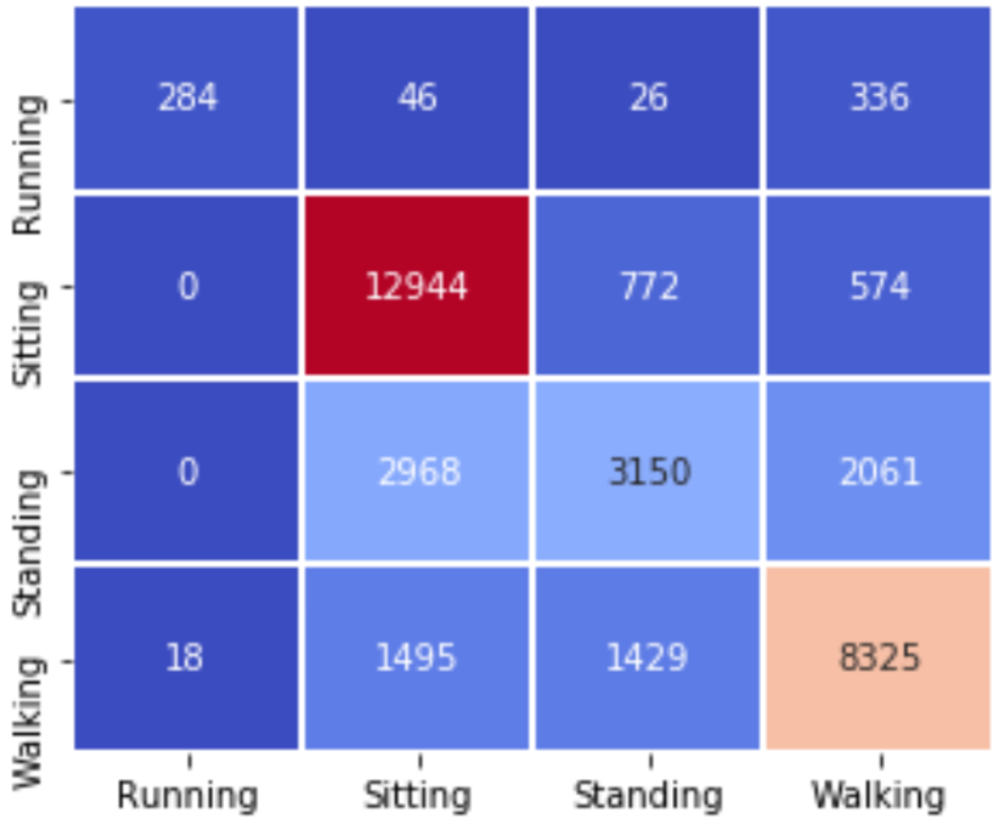

# Baboon Learning

## Overview

Despite a recent dramatic rise in the deployment of animal-borne movement sensors, very few studies have attempted to use movement data to classify fine-scale behavioral activity of animals. This project fills the void by exploring behavioral activity of baboons with deep neural networks. To predict and classify the activity, baboons were fitted with e-obs biologging collars that collected data from GPS units, tri-axial accelerometeres and magnetometers. The GPS sampled at 1 Hz and the accelerometer and magnetometer sampled at 12 Hz. Data from these collars amounted to 100,000 labeled samples and approximately 7.5 million unlabeled samples. Extracting useful information from the unlabeled data in a sparsely labeled dataset to aid with classification has the potential to greatly improve both human and animal activity recognition. Accordingly, this project also aims to determine whether learning the representations of the unlabeled data of a dataset with an self-supervised approach improves the performance of a supervised learning algorithm on the labeled data of the same dataset.

## Approach

The supervised learning aspect, also known as the "Not-pretrained" in the Figure BLANK, focused on training and testing Multilayer Perceptron (MLP), Time-Aggregrated Multilayer Perceptron (TA-MLP), Convolutional Neural Network (CNN), Long Short-Term Memory (LSTM), Convolutional LSTM (CNN-LSTM), bidirectional LSTM (b-LSTM) and bidirectional Convolutional LSTM (b-CNN-LSTM) on the labeled dataset. In this step, each model was trained for a classification task of identifying the behavior of baboons as one of four classes, Running, Walking, Sitting, and Standing at rest. The self-supervised learning aspect, however, includes four steps:

  1. Encode unlabeled samples with an autoencoder
  2. Train autoencoder on unlabeled samples
  3. Extract weight from encoder layer after training is complete
  4. Utlize these weights for classification, the same as the supervised learning approach

The autoencoders helped the models learn representations of the data, but these representations may not have been relevant to the classification task. Figure BLANK shows that the performances of MLP, TA-MLP, and LSTM actually decreased after pretraining on the unlabeled dataset.

### Features

Latitude, Longitude, Speed, Heading, X-acceleration, Y- acceleration, and Z-acceleration

## Results

The CNN outperformed all other models on the test set with an F1 score of 0.75. Given that accelerometer data can contain a significant amount of noise, it is possible that the convolutional layers were critically important to reduce the impact of noise in the data to allow for accurate classification on the data set; this reduction in noise may explain the CNN’s performance over the the network with an LSTM layer. This, however, does not explain why the CNN-LSTM (or b-CNN-LSTM), which should combine the feature extraction and noise reduction associated with a CNN with an LSTM’s capability to learn sequential dependencies, does not reach the highest performance. Three explanations could explain why the CNN outperformed the CNN-LSTM. First, the CNN-LSTM only applied a convolution over a window- size of four with a filter size of two. This convolution may have been too local to extract the higher-level features that the CNN was apparently able to capture. Secondly, the CNN- LSTM had two convolutional layers while the CNN had four convolution layers. These extra two convolutional layers would have allowed the CNN to extract more global information from each time-window. Lastly, the CNN-LSTM, with over 100,000 trainable parameters, likely have simply had too many parameters for our relatively small dataset to train.

### Comparison Between models

Since pretraining did not positively affect the performances of the models, only test results from the Not_pretrained" models are shown below.

### Confusion Matrix of Each model

The x-axis represents the predicted label and the y-axis represents the true label.

### Multilayer Perceptron

### Time-Aggregrated Multilayer Perceptron

### Convolutional Neural Network

### Long Short-Term Memory

### Convolutional Long Short-Term Memory

### bidirectional Long Short-Term Memory

### bidirectional Convolutional Long Short-Term Memory

